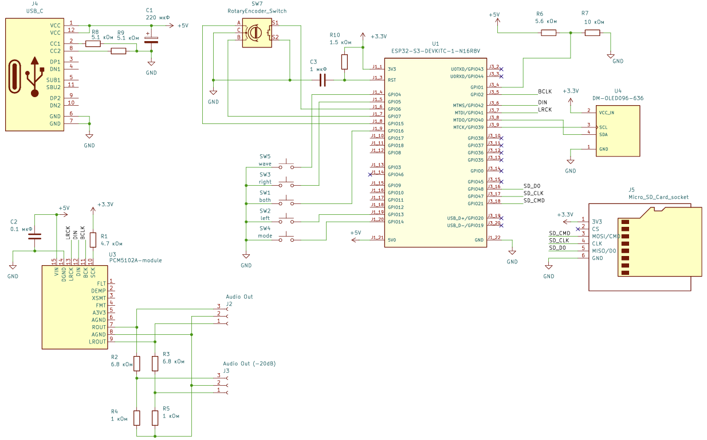

# AGP-S3: Dual-Channel Audio Generator & SD Player

[English](#english) | [Українська](#ukrainian) | [русский](#russian)

---

## English

**AGP-S3** is a compact dual-channel low-frequency DDS signal generator and audio player for lossless and high-resolution audio files. The device is based on an **ESP32-S3** microcontroller and a dedicated stereo **PCM5102A** DAC supporting up to 192 kHz / 24-bit audio.

The instrument is intended for testing, adjustment, and repair of audio equipment, including power amplifiers, loudspeakers, crossovers, equalizers, and other stages in the audio signal path.

---

## 📝 Author's Preface and Project Backstory

The idea for this device came from a practical problem encountered while building a home media centre based on an ESP32 and TPA3255, and assembling a custom 10-inch subwoofer using an Alpine driver and a TPA3255 monoblock in parallel bridge-tied load (PBTL) mode.

I had a portable FNIRSI DSO-TC4 on the bench, combining an oscilloscope and a signal generator. Both instruments share a common circuit ground. When adjusting an amplifier operating in bridge mode (BTL/PBTL), it is therefore not possible to apply a test signal to the input and measure the output with the oscilloscope at the same time: the test equipment would connect one output phase to ground.

The initial plan was to build a simple standalone sine-wave generator from the parts available. Since an **ESP32-S3 (N16R8)** was available, the project developed into a more complete instrument.

The result is a laboratory instrument covering two applications:
1. **Audio-equipment adjustment:** a dual-channel pure-tone generator, phase shifter, and test-noise source with galvanically isolated outputs for use with an oscilloscope.
2. **Audio playback:** a standalone player for lossless audio files that can be used as a reference source when evaluating audio signal paths.

Many DIY generators use the microcontroller's internal DACs or PWM output. Depending on the implementation, these can introduce significant distortion and unwanted spectral components. The **AGP-S3** uses a dedicated **PCM5102A** stereo DAC connected through I2S. The ESP32-S3 performs the phase and frequency calculations in real time.

---

## 🚀 Key Features

* **Dual-core operation:** Audio generation and I2S servicing run on one ESP32-S3 core, while the user interface, button handling, and SD-card access run on the other.
* **Audio output:** The PCM5102A provides an analogue output with sample rates up to 192 kHz and 24-bit samples.
* **Dual-channel DDS generator:** Frequency range from **1 Hz to 24,000 Hz**, with adjustment steps down to **0.1 Hz**. Supported waveforms: *Sine* and *Square*.
* **Phase control:** Manual phase adjustment between channels from $0^{\circ}$ to $360^{\circ}$ in $10^{\circ}$ steps, plus continuous automatic phase rotation at a user-defined speed.
* **Test noise and signals:** White-noise and pink-noise generators, plus a two-tone intermodulation-distortion (IMD) test mode.
* **Audio player:** Playback of **WAV, MP3, OGG, and FLAC** files from a FAT32 MicroSD card.
* **Built-in attenuator:** Two pairs of analogue RCA outputs: direct output (0 dB) and attenuated output (-20 dB) through a precision resistor divider for lower-level inputs.
* **Non-volatile settings:** Current settings and parameters are stored in the ESP32-S3 flash memory.

---

## 🛠 Technical Specifications

| Parameter | Value |
| :--- | :--- |
| **Microcontroller** | ESP32-S3-WROOM-1 (N16R8) |
| **DAC** | Texas Instruments PCM5102A (I2S) |
| **Resolution / Sample Rate** | 24-bit / up to 192 kHz |
| **Generator Frequency Range** | 1 Hz – 24,000 Hz |
| **Frequency Adjustment Step** | 0.1 Hz / 1 Hz / 10 Hz / 100 Hz / 1000 Hz |
| **Waveforms** | Sine, Square (Meander) |
| **Phase Adjustment** | $0^{\circ} - 360^{\circ}$ ($10^{\circ}$ step) + automatic rotation mode |
| **Noise Modes** | White Noise, Pink Noise, IMD (two-tone test) |
| **Supported Card Formats** | MicroSD, FAT32 (up to 32 GB) |
| **Supported Audio Formats** | MP3, WAV, FLAC, OGG |
| **Display** | OLED 0.96" (SSD1306, I2C, 128x64) |
| **Power Supply** | USB Type-C (5V) |

---

## 📦 Bill of Materials (BOM)

The main components required to build the device are listed below:

| Component | Description / Module | Qty |
| :--- | :--- | :--- |
| **Microcontroller** | ESP32-S3-DevKitC-1-N16R8V (or compatible board with 16MB Flash and 8MB PSRAM) | 1 pc. |
| **DAC** | PCM5102A DAC module with I2S interface | 1 pc. |
| **Display** | OLED 0.96" 128x64 module (SSD1306 driver, I2C interface) | 1 pc. |
| **Encoder** | EC11 incremental encoder with integrated push-button | 1 pc. |
| **Buttons** | Tactile push-buttons (12x12x7.5 mm) | 5 pcs. |
| **Card Reader** | MicroSD slot (TF-Card) wired for SD_MMC mode | 1 pc. |
| **Output Connectors** | Chassis-mount RCA jacks for the audio outputs | 4 pcs. |
| **Power Connector** | Chassis-mount USB Type-C female breakout for 5V power | 1 pc. |
| **Passives** | Resistors and capacitors specified in the schematic | 1 set |

---

## 📂 Repository Structure

```text
├── hardware/                 # Schematics and PCB layout
│    ├── kicad_project/       # Original project files in KiCad
│    ├── scheme_v2.pdf        # Complete schematic diagram in vector PDF format
│    └── scheme.png           # Schematic image for quick preview
├── src/                      # Source code for Arduino IDE (.ino)
├── docs/                     # Documentation and manuals
│    └── User manual.pdf      # Complete User Manual (in Russian)
├── images/                   # Photos and project media files
├── LICENSE                   # MIT License
└── README.md                 # Project overview (this file)
```
---

## 🔌 Hardware & Pinout

The complete schematic diagram is available in [`hardware/scheme_v2.pdf`](hardware/scheme_v2.pdf).



All controls (buttons and encoder) are wired with one terminal connected to a GPIO and the other to GND. The firmware uses the internal pull-up configuration: `INPUT_PULLUP`.

### ESP32-S3 Pin Mapping Table:

| GPIO | Function | Constant in `Config.h` / Settings |
| :--- | :--- | :--- |
| **GPIO 1** | 5V Power Detector (5V detected) | |
| **GPIO 2** | BCLK (PCM5102A DAC) | `BCLK_PIN` |
| **GPIO 4** | Tactile button "WAVE" | `PIN_BTN_5` |
| **GPIO 5** | Tactile button "RIGHT CH" | `PIN_BTN_3` |
| **GPIO 6** | Encoder Button (Enc Btn) | `PIN_ENC_BTN` |
| **GPIO 7** | Encoder Direction A (Enc+) | `PIN_ENC_A` |
| **GPIO 13**| Tactile button "LEFT CH" | `PIN_BTN_2` |
| **GPIO 14**| Tactile button "MODE" | `PIN_BTN_4` |
| **GPIO 15**| Encoder Direction B (Enc-) | `PIN_ENC_B` |
| **GPIO 16**| Tactile button "BOTH CH" | `PIN_BTN_1` |
| **GPIO 21**| TF-Card CMD (SD_MMC class) | `SD_MMC_CMD` |
| **GPIO 39**| SCL (SSD1306 Display) | `SCL_PIN` |
| **GPIO 40**| SDA (SSD1306 Display) | `SDA_PIN` |
| **GPIO 41**| LRCK / WS (PCM5102A DAC) | `LRCK_PIN` |
| **GPIO 42**| DIN / DOUT (PCM5102A DAC) | `DIN_PIN` |
| **GPIO 47**| TF-Card CLK (SD_MMC class) | `SD_MMC_CLK` |
| **GPIO 48**| TF-Card D0 (SD_MMC class) | `SD_MMC_D0` |

---

## 💻 Environment Setup & Flashing

To compile and upload the firmware to the ESP32-S3 through the development board's USB port, use the following **Arduino IDE** settings:

* **Board:** `ESP32S3 Dev Module`
* **Port:** Select the COM port of the connected device
* **USB CDC On Boot:** `Enabled` (for debug output in the Serial Monitor)
* **CPU Frequency:** `240MHz (WiFi/BT)`
* **Core Debug Level:** `None`
* **USB DFU On Boot:** `Disabled`
* **Erase All Flash Before Sketch Upload:** `Disabled`
* **Arduino Runs On:** `Core 0`
* **Events Run On:** `Core 1`
* **Flash Frequency:** `80MHz`
* **Flash Mode:** `QIO 80MHz`
* **Flash Size:** `16MB (128Mb)`
* **JTAG Adapter:** `Integrated USB JTAG`
* **Partition Scheme:** `16M Flash (3MB APP/9.9MB FATFS)`
* **PSRAM:** `OPI PSRAM`
* **Upload Mode:** `UART0 / Hardware CDC`
* **Upload Speed:** `921600`

---

## 🎮 Device Control (Quick Start)


### 1. Main Menu Navigation (Mode Selection)

When the device is powered on, or when the Main Menu is opened, the display shows the available operating modes.

* **Mode Selection (Moving the Highlight):** Use the **[LEFT]** and **[RIGHT]** buttons or turn the encoder. The selected mode is highlighted on the display.
* **Entering the Selected Mode:** Press **[BOTH]** to confirm and enter the highlighted mode.
* **Returning to the Main Menu:** From any active operating mode, press and hold **[MODE]**.

---

### 2. Setting the Frequency (in Generator Modes):

Frequency adjustment works as follows:
1. **Enter Frequency Edit Mode:** Press and **hold** one of the channel-selection buttons — **[LEFT]**, **[BOTH]**, or **[RIGHT]**.
2. **Select a Digit:** Press **[LEFT]** to move to the left and select a higher-order digit, or **[RIGHT]** to move to the right and select a lower-order digit. The selected position is marked by an underline cursor.
3. **Change the Digit Value:** Turn the encoder to increase or decrease the value of the selected digit.
4. **Exit Frequency Edit Mode:** Press **[BOTH]** to apply the changes and return to the normal display.

---

### 3. Operating Modes:

#### 📺 SCREEN 1. Wave Generator
This screen allows the left and right channels to be configured independently or together:
* The **[WAVE]** button cycles between **Sine** and **Square** waveforms.
* In the right-channel view (RIGHT), set the phase shift relative to the left channel from 0° to 360° in 10° steps, or enable automatic phase rotation at a speed from 1°/s to 360°/s.

#### 📺 SCREEN 2. Noises & Tests
Generates uncorrelated test signals and noise. Press any of the following buttons briefly to change the active signal type: [Left], [Both], [Right], or [Wave].
* **White Noise:** Approximately uniform spectral power density across the frequency range.
* **Pink Noise:** Spectral power density decreases by 3 dB per octave.
* **IMD (Intermodulation Distortion Test):** A two-tone signal for evaluating intermodulation distortion, with $f_1$ and $f_2$ mixed at user-defined amplitude ratios.

#### 📺 SCREEN 3. Audio Player
Plays WAV, MP3, OGG, and FLAC files from a FAT32 MicroSD card.
* Repeat options: repeat all files in the current folder (`Folder`) or repeat the current track (`Repeat`).
* Player controls:
  * **[LEFT]** — Previous track / rewind.
  * **[RIGHT]** — Next track / fast-forward.
  * **[BOTH]** — Start / stop playback.
  * **[WAVE]** — Pause playback.

#### 📺 SCREEN 4. Settings
Navigate through the settings list by turning the encoder or pressing [LEFT] / [RIGHT].
* To edit a setting, press the encoder button **[Encoder]** or **[BOTH]**. The cursor moves to the parameter value.
* Change the value by turning the encoder.
* Press the encoder button or **[BOTH]** again to save the setting in non-volatile memory.

**Some menu parameters:**
* `Phase Rot` (Automatic Phase Rotation): Rotation speed from 1°/s to 360°/s.
* `IMD f1`, `IMD f2`: Frequencies used for the two-tone intermodulation test.
* `IMD Amplit f1`, `IMD Amplit f2`: Amplitude ratios for the two tones; their sum must be 1.0, for example 0.8 and 0.2.
* `Player Mode`: Player repeat mode (`Folder` / `Repeat`).
* `Start Scr` (Startup Screen): Screen opened at startup (`Main`, `Waves`, `Noises`, `MP3`).

---

⚠️ **Important Note:** This Quick Start section covers the basic controls and the main operating modes. For the complete description of the operating modes, settings, and procedures, refer to the User Manual: [`docs/User manual.pdf`](docs/User%20manual.pdf) (currently available in Russian).

---

### Support
If you find this project useful and want to support the author, donations can be made using any of the following methods:

- **PayPal**: [gia@gia.org.ua] [Donate via PayPal](https://www.paypal.me)  
- **Ko-fi**: [Donate on Ko-fi](https://ko-fi.com/igorgimelfarb)  
- **Monobank**: Scan the QR code or use the link: [Support via Monobank](https://send.monobank.ua/jar/8HG6A3VPaW)


---

## ⚖️ License

This project is distributed under the **MIT License**. It may be used, modified, and distributed for commercial and non-commercial purposes, provided that the original copyright notice and author attribution are retained. See the [LICENSE](LICENSE) file for details.

---
*Project Author: Igor Gimelfarb (2026)*

---

###### Tags / Keywords: 
`esp32s3 audio generator`, `DDS signal generator DIY`, `PCM5102A I2S DAC`, `hi-res lossless player ESP32`, `audio testing tool`, `phase rotation generator`, `pink noise generator DIY`, `IMD test signal`, `BTL amplifier tuning`, `KiCad audio circuit`

---

[English](#english) | [Українська](#ukrainian) | [русский](#russian)

---

## Ukrainian

# AGP-S3: Dual-Channel Audio Generator & SD Player

**AGP-S3** — компактний двоканальний низькочастотний DDS-генератор сигналів і аудіоплеєр для відтворення аудіофайлів без втрат та у форматах високої роздільності. Пристрій побудований на базі мікроконтролера **ESP32-S3** та спеціалізованого стерео-ЦАП **PCM5102A** з підтримкою до 192 кГц / 24 біт.

Прилад призначений для тестування, налаштування та ремонту аудіоапаратури, зокрема підсилювачів потужності, акустичних систем, кросоверів, еквалайзерів та інших ланок звукового тракту.

---

## 📝 Передмова автора та передісторія проєкту

Ідея створення цього приладу виникла з практичної задачі. Під час побудови домашнього медіацентру на базі ESP32 і TPA3255 та складання кастомного 10-дюймового сабвуфера з динаміком Alpine і моноблоком TPA3255 у режимі паралельного мостового навантаження (PBTL) я зіткнувся з проблемою налаштування аудіосистеми.

На робочому столі був портативний FNIRSI DSO-TC4, який поєднує осцилограф і генератор сигналів. Обидва прилади мають спільну схемну землю. Під час налаштування підсилювача у мостовому режимі (BTL/PBTL) неможливо одночасно подати тестовий сигнал на вхід і вимірювати вихід осцилографом: вимірювальний прилад з'єднає одну з вихідних фаз із землею.

Спочатку планувалося зібрати простий автономний генератор синусоїдального сигналу з доступних деталей. Оскільки під рукою був **ESP32-S3 (N16R8)**, проєкт переріс початковий задум.

У результаті вийшов лабораторний прилад для двох основних задач:
1. **Налаштування аудіоапаратури:** двоканальний генератор чистих тонів, фазообертач і генератор тестових шумів із гальванічно розв'язаними виходами для роботи з осцилографом.
2. **Відтворення аудіо:** автономний програвач аудіофайлів без втрат, який можна використовувати як еталонне джерело під час оцінювання звукових трактів.

У багатьох аматорських генераторах використовуються внутрішні ЦАП мікроконтролера або ШІМ-вихід. Залежно від реалізації це може призводити до значних спотворень і небажаних спектральних складових. В **AGP-S3** використовується спеціалізований стерео-ЦАП **PCM5102A**, підключений через I2S. ESP32-S3 виконує розрахунок фази та частоти в реальному часі.

---

## 🚀 Ключові особливості

* **Робота з двома ядрами:** генерація звуку та обслуговування шини I2S виконуються на одному ядрі ESP32-S3, а графічний інтерфейс, обробка кнопок і робота з SD-картою — на іншому.
* **Аудіовихід:** PCM5102A забезпечує аналоговий сигнал із частотою дискретизації до 192 кГц і 24-бітними відліками.
* **Двоканальний DDS-генератор:** діапазон частот від **1 Гц до 24 000 Гц**, крок налаштування — до **0,1 Гц**. Підтримувані форми сигналу: *Синусоїда* та *Меандр*.
* **Керування фазою:** ручне встановлення зсуву фази між каналами від $0^{\circ}$ до $360^{\circ}$ із кроком $10^{\circ}$, а також безперервне автоматичне обертання фази із заданою швидкістю.
* **Тестові шуми та сигнали:** генератори білого й рожевого шуму, а також режим двотонального тесту інтермодуляційних спотворень (IMD).
* **Аудіоплеєр:** відтворення файлів **WAV, MP3, OGG і FLAC** із карти MicroSD у форматі FAT32.
* **Вбудований атенюатор:** дві пари аналогових виходів RCA: прямий вихід (0 дБ) і вихід із послабленням -20 дБ через прецизійний резистивний дільник для входів із нижчим рівнем сигналу.
* **Енергонезалежні налаштування:** поточні налаштування та параметри зберігаються у флеш-пам'яті ESP32-S3.

---

## 🛠 Технічні характеристики

| Параметр | Значення |
| :--- | :--- |
| **Мікроконтролер** | ESP32-S3-WROOM-1 (N16R8) |
| **ЦАП (DAC)** | Texas Instruments PCM5102A (I2S) |
| **Розрядність / Частота дискретизації** | 24 біт / до 192 кГц |
| **Діапазон частот генератора** | 1 Гц – 24 000 Гц |
| **Крок налаштування частоти** | 0,1 Гц / 1 Гц / 10 Гц / 100 Гц / 1000 Гц |
| **Форми сигналу** | Синусоїда (Sine), Меандр (Square) |
| **Регулювання фази** | $0^{\circ} - 360^{\circ}$ (крок $10^{\circ}$) + автоматичне обертання |
| **Режими шумів** | Білий шум, рожевий шум, IMD (двотональний тест) |
| **Підтримувані формати карт пам'яті** | MicroSD, FAT32 (до 32 ГБ) |
| **Підтримувані аудіоформати** | MP3, WAV, FLAC, OGG |
| **Дисплей** | OLED 0.96" (SSD1306, I2C, 128x64) |
| **Живлення** | USB Type-C (5 В) |

---

## 📦 Список компонентів (BOM)

Основні компоненти, необхідні для складання пристрою:

| Компонент | Опис / Модуль | Кількість |
| :--- | :--- | :--- |
| **Мікроконтролер** | ESP32-S3-DevKitC-1-N16R8V (або сумісна плата з 16MB Flash та 8MB PSRAM) | 1 шт. |
| **ЦАП** | Модуль ЦАП PCM5102A з інтерфейсом I2S | 1 шт. |
| **Дисплей** | Модуль OLED 0.96" 128x64 (драйвер SSD1306, інтерфейс I2C) | 1 шт. |
| **Енкодер** | Інкрементальний енкодер EC11 із вбудованою кнопкою | 1 шт. |
| **Кнопки** | Тактові кнопки 12x12x7.5 мм | 5 шт. |
| **Кардридер** | Слот MicroSD (TF-Card) для роботи в режимі SD_MMC | 1 шт. |
| **Вихідні роз'єми** | Панельні гнізда RCA для аудіовиходів | 4 шт. |
| **Роз'єм живлення** | Панельний роз'єм USB Type-C для живлення 5 В | 1 шт. |
| **Пасивні елементи** | Резистори та конденсатори згідно зі схемою | 1 компл. |

---

## 📂 Структура репозиторію

```text
├── hardware/                 # Схемотехніка та друкована плата
│    ├── kicad_project/       # Вихідні файли проєкту в KiCad
│    ├── scheme_v2.pdf        # Повна принципова схема у векторному форматі PDF
│    └── scheme.png           # Зображення принципової схеми для швидкого перегляду
├── src/                      # Вихідний код проєкту для Arduino IDE (.ino)
├── docs/                     # Документація та посібники
│    └── User manual.pdf      # Повний посібник користувача (російською мовою)
├── images/                   # Фотографії та медіафайли проєкту
├── LICENSE                   # Ліцензія MIT
└── README.md                 # Опис проєкту (цей файл)
```
---

## 🔌 Схемотехніка та розпиновка пристрою


Повна принципова схема пристрою у форматі PDF знаходиться у файлі [`hardware/scheme_v2.pdf`](hardware/scheme_v2.pdf).

Усі органи керування (кнопки та енкодер) підключені так: один вивід підключений до GPIO, другий — до GND. У прошивці використовується внутрішня підтяжка входу: `INPUT_PULLUP`.

### Таблиця підключення периферії до ESP32-S3:

| GPIO | Призначення | Константа в `Config.h` / Налаштування |
| :--- | :--- | :--- |
| **GPIO 1** | Детектор живлення 5 В (5V detected) | |
| **GPIO 2** | BCLK (ЦАП PCM5102A) | `BCLK_PIN` |
| **GPIO 4** | Тактова кнопка «WAVE» | `PIN_BTN_5` |
| **GPIO 5** | Тактова кнопка «RIGHT CH» | `PIN_BTN_3` |
| **GPIO 6** | Кнопка енкодера (Enc Btn) | `PIN_ENC_BTN` |
| **GPIO 7** | Напрямок енкодера (Enc+) | `PIN_ENC_A` |
| **GPIO 13**| Тактова кнопка «LEFT CH» | `PIN_BTN_2` |
| **GPIO 14**| Тактова кнопка «MODE» | `PIN_BTN_4` |
| **GPIO 15**| Напрямок енкодера (Enc-) | `PIN_ENC_B` |
| **GPIO 16**| Тактова кнопка «BOTH CH» | `PIN_BTN_1` |
| **GPIO 21**| TF-Card CMD (клас SD_MMC) | `SD_MMC_CMD` |
| **GPIO 39**| SCL (дисплей SSD1306) | `SCL_PIN` |
| **GPIO 40**| SDA (дисплей SSD1306) | `SDA_PIN` |
| **GPIO 41**| LRCK / WS (ЦАП PCM5102A) | `LRCK_PIN` |
| **GPIO 42**| DIN / DOUT (ЦАП PCM5102A) | `DIN_PIN` |
| **GPIO 47**| TF-Card CLK (клас SD_MMC) | `SD_MMC_CLK` |
| **GPIO 48**| TF-Card D0 (клас SD_MMC) | `SD_MMC_D0` |

---

## 💻 Налаштування середовища та прошивка

Для компіляції та завантаження прошивки в ESP32-S3 через USB-роз'єм плати розробника використовуйте такі параметри **Arduino IDE**:

* **Board (Плата):** `ESP32S3 Dev Module`
* **Port (Порт):** Виберіть COM-порт підключеного пристрою
* **USB CDC On Boot:** `Enabled` (для виведення повідомлень налагодження в Serial Monitor)
* **CPU Frequency:** `240MHz (WiFi/BT)`
* **Core Debug Level:** `None`
* **USB DFU On Boot:** `Disabled`
* **Erase All Flash Before Sketch Upload:** `Disabled`
* **Arduino Runs On:** `Core 0`
* **Events Run On:** `Core 1`
* **Flash Frequency:** `80MHz`
* **Flash Mode:** `QIO 80MHz`
* **Flash Size:** `16MB (128Mb)`
* **JTAG Adapter:** `Integrated USB JTAG`
* **Partition Scheme:** `16M Flash (3MB APP/9.9MB FATFS)`
* **PSRAM:** `OPI PSRAM`
* **Upload Mode:** `UART0 / Hardware CDC`
* **Upload Speed:** `921600`

---

## 🎮 Керування пристроєм (Швидкий старт)


### 1. Навігація на Головному екрані (Вибір режиму)

Після увімкнення приладу або переходу на Головний екран дисплей показує список доступних режимів роботи.

* **Вибір режиму (переміщення підсвічування):** Використовуйте кнопки **[LEFT]**, **[RIGHT]** або обертайте енкодер. Вибраний режим буде підсвічено на дисплеї.
* **Вхід у вибраний режим:** Натисніть **[BOTH]**, щоб підтвердити вибір і відкрити режим.
* **Повернення на Головний екран:** Із будь-якого активного режиму натисніть і утримуйте **[MODE]**.

---

### 2. Налаштування частоти (у режимах генератора):

Налаштування частоти виконується так:
1. **Вхід у режим редагування частоти:** Натисніть і **утримуйте** одну з кнопок вибору каналів — **[LEFT]**, **[BOTH]** або **[RIGHT]**.
2. **Вибір розряду:** Натискайте **[LEFT]**, щоб перейти ліворуч і вибрати старший розряд, або **[RIGHT]**, щоб перейти праворуч і вибрати молодший розряд. Вибрана позиція позначається курсором-підкресленням.
3. **Зміна значення розряду:** Обертайте енкодер, щоб збільшити або зменшити значення вибраного розряду.
4. **Вихід із режиму редагування частоти:** Натисніть **[BOTH]**, щоб застосувати зміни та повернутися до звичайного відображення.

---

### 3. Режими роботи приладу:

#### ЕКРАН 1. Генератор сигналів (Waves)
Цей екран дає змогу незалежно або спільно налаштовувати лівий і правий канали:
* Кнопка **[WAVE]** почергово вибирає **синусоїду** або **меандр**.
* На екрані правого каналу (RIGHT) можна встановити зсув фази відносно лівого каналу від 0° до 360° із кроком 10° або ввімкнути автоматичне обертання фази зі швидкістю від 1°/с до 360°/с.

#### ЕКРАН 2. Шуми та тести (Noises)
Генерує некорельовані тестові сигнали та шуми. Для вибору типу сигналу коротко натискайте одну з кнопок: [Left], [Both], [Right] або [Wave]:
* **White Noise (білий шум):** приблизно рівномірна спектральна щільність потужності в діапазоні частот.
* **Pink Noise (рожевий шум):** спад спектральної щільності потужності на 3 дБ на октаву.
* **IMD (Intermodulation Distortion Test):** двотональний сигнал для оцінювання інтермодуляційних спотворень, у якому $f_1$ та $f_2$ змішуються в заданих співвідношеннях амплітуд.

#### ЕКРАН 3. Аудіоплеєр (Player)
Відтворює файли WAV, MP3, OGG і FLAC із карти MicroSD у форматі FAT32.
* Режими повторення: усі файли поточної папки (`Folder`) або поточний трек (`Repeat`).
* Керування плеєром:
  * **[LEFT]** — попередній трек / перемотування назад.
  * **[RIGHT]** — наступний трек / перемотування вперед.
  * **[BOTH]** — початок / зупинка відтворення.
  * **[WAVE]** — пауза відтворення.

#### ЕКРАН 4. Налаштування (Settings)
Переміщуйтеся списком параметрів обертанням енкодера або натисканням [LEFT] / [RIGHT].
* Для редагування параметра натисніть кнопку енкодера **[Encoder]** або **[BOTH]**. Курсор переміститься до значення параметра.
* Змініть значення обертанням енкодера.
* Натисніть кнопку енкодера або **[BOTH]** ще раз, щоб зберегти налаштування в енергонезалежній пам'яті.

**Деякі параметри меню:**
* `Phase Rot` (Автоматичне обертання фази): швидкість від 1°/с до 360°/с.
* `IMD f1`, `IMD f2`: частоти для двотонального тесту інтермодуляційних спотворень.
* `IMD Amplit f1`, `IMD Amplit f2`: співвідношення амплітуд двох тонів; сума має дорівнювати 1,0, наприклад 0,8 і 0,2.
* `Player Mode`: режим повторення плеєра (`Folder` / `Repeat`).
* `Start Scr` (Стартовий екран): екран, який відкривається під час запуску (`Main`, `Waves`, `Noises`, `MP3`).

---

⚠️ **Важлива примітка:** У цьому розділі «Швидкий старт» описано основні елементи керування та режими роботи. Повний опис режимів, налаштувань і процедур наведено в посібнику користувача: [`docs/User manual.pdf`](docs/User%20manual.pdf) (нині доступний російською мовою).

---

### Підтримка
Якщо цей проєкт став вам у пригоді, підтримати автора можна одним із таких способів:

- **PayPal**: [gia@gia.org.ua] [Donate via PayPal](https://www.paypal.me)  
- **Ko-fi**: [Donate on Ko-fi](https://ko-fi.com/igorgimelfarb)  
- **Monobank**: відскануйте QR-код або скористайтеся посиланням: [Підтримати через Monobank](https://send.monobank.ua/jar/8HG6A3VPaW)


---

## ⚖️ Ліцензія

Цей проєкт поширюється за ліцензією **MIT**. Його можна використовувати, змінювати та поширювати в комерційних і некомерційних цілях за умови збереження початкового повідомлення про авторські права та зазначення автора. Подробиці наведено у файлі [LICENSE](LICENSE).

---
*Автор проєкту: Ігор Гімельфарб (2026 р.)*

---

###### Теги / Ключові слова:
`генератор звукових частот ESP32`, `DDS генератор сигналів`, `ЦАП PCM5102A I2S`, `аудіоплеєр на ESP32-S3`, `вимірювання спотворень підсилювача`, `генератор рожевого шуму`, `тестування мостових підсилювачів`, `радіоаматорські прилади DIY`

---

[English](#english) | [Українська](#ukrainian) | [русский](#russian)

---

## russian

# AGP-S3: Dual-Channel Audio Generator & SD Player

**AGP-S3** — компактный двухканальный низкочастотный DDS-генератор сигналов и аудиопроигрыватель для файлов без потерь и файлов высокого разрешения. Устройство построено на базе микроконтроллера **ESP32-S3** и специализированного стерео-ЦАП **PCM5102A** с поддержкой до 192 кГц / 24 бит.

Прибор предназначен для тестирования, настройки и ремонта аудиоаппаратуры, включая усилители мощности, акустические системы, кроссоверы, эквалайзеры и другие звенья звукового тракта.

---

## 📝 Предисловие автора и предыстория проекта

Идея создания этого прибора возникла из практической задачи. Во время создания домашнего медиацентра на базе ESP32 и TPA3255 и сборки кастомного 10-дюймового сабвуфера с динамиком Alpine и моноблоком TPA3255 в режиме параллельной мостовой нагрузки (PBTL) я столкнулся с проблемой настройки аудиосистемы.

На рабочем столе был портативный FNIRSI DSO-TC4, совмещающий осциллограф и генератор сигналов. Оба прибора имеют общую схемную землю. При настройке усилителя в мостовом режиме (BTL/PBTL) невозможно одновременно подать тестовый сигнал на вход и измерять выход осциллографом: измерительный прибор соединит одну из выходных фаз с землей.

Сначала планировалось собрать простой автономный генератор синусоидального сигнала из доступных деталей. Поскольку под рукой был **ESP32-S3 (N16R8)**, проект вышел за рамки первоначальной задачи.

В результате получился лабораторный прибор для двух основных задач:
1. **Настройка аудиоаппаратуры:** двухканальный генератор чистых тонов, фазовращатель и генератор тестовых шумов с гальванически развязанными выходами для работы с осциллографом.
2. **Воспроизведение аудио:** автономный проигрыватель аудиофайлов без потерь, который можно использовать как эталонный источник при оценке звуковых трактов.

Во многих любительских генераторах используются встроенные ЦАП микроконтроллера или ШИМ-выход. В зависимости от реализации это может приводить к значительным искажениям и появлению нежелательных спектральных составляющих. В **AGP-S3** используется специализированный стерео-ЦАП **PCM5102A**, подключенный по шине I2S. ESP32-S3 выполняет расчёт фазы и частоты в реальном времени.

---

## 🚀 Ключевые особенности

* **Работа с двумя ядрами:** генерация звука и обслуживание шины I2S выполняются на одном ядре ESP32-S3, а графический интерфейс, обработка кнопок и работа с SD-картой — на другом.
* **Аудиовыход:** PCM5102A обеспечивает аналоговый сигнал с частотой дискретизации до 192 кГц и 24-битными отсчётами.
* **Двухканальный DDS-генератор:** диапазон частот от **1 Гц до 24 000 Гц**, шаг настройки — до **0.1 Гц**. Поддерживаемые формы сигнала: *Синусоида* и *Меандр*.
* **Управление фазой:** ручная установка сдвига фазы между каналами от $0^{\circ}$ до $360^{\circ}$ с шагом $10^{\circ}$, а также непрерывное автоматическое вращение фазы с заданной скоростью.
* **Тестовые шумы и сигналы:** генераторы белого и розового шума, а также режим двухтонального теста интермодуляционных искажений (IMD).
* **Аудиопроигрыватель:** воспроизведение файлов **WAV, MP3, OGG и FLAC** с карты MicroSD в формате FAT32.
* **Встроенный аттенюатор:** две пары аналоговых выходов RCA: прямой выход (0 дБ) и выход с ослаблением -20 дБ через прецизионный резистивный делитель для входов с более низким уровнем сигнала.
* **Энергонезависимые настройки:** текущие настройки и параметры сохраняются во флеш-памяти ESP32-S3.

---

## 🛠 Технические характеристики

| Параметр | Значение |
| :--- | :--- |
| **Микроконтроллер** | ESP32-S3-WROOM-1 (N16R8) |
| **ЦАП (DAC)** | Texas Instruments PCM5102A (I2S) |
| **Разрядность / Частота дискретизации** | 24 бит / до 192 кГц |
| **Диапазон частот генератора** | 1 Гц – 24 000 Гц |
| **Шаг настройки частоты** | 0.1 Гц / 1 Гц / 10 Гц / 100 Гц / 1000 Гц |
| **Формы сигнала** | Синусоида (Sine), Меандр (Square) |
| **Регулировка фазы** | $0^{\circ} - 360^{\circ}$ (шаг $10^{\circ}$) + автоматическое вращение |
| **Режимы шумов** | Белый шум, розовый шум, IMD (двухтональный тест) |
| **Поддерживаемые форматы карт памяти** | MicroSD, FAT32 (до 32 ГБ) |
| **Поддерживаемые аудиоформаты** | MP3, WAV, FLAC, OGG |
| **Дисплей** | OLED 0.96" (SSD1306, I2C, 128x64) |
| **Питание** | USB Type-C (5 В) |

---

## 📦 Список компонентов (BOM)

Основные компоненты, необходимые для сборки устройства:

| Компонент | Описание / Модуль | Кол-во |
| :--- | :--- | :--- |
| **Микроконтроллер** | ESP32-S3-DevKitC-1-N16R8V (или совместимая плата с 16MB Flash и 8MB PSRAM) | 1 шт. |
| **ЦАП** | Модуль ЦАП PCM5102A с интерфейсом I2S | 1 шт. |
| **Дисплей** | Модуль OLED 0.96" 128x64 (драйвер SSD1306, интерфейс I2C) | 1 шт. |
| **Энкодер** | Инкрементальный энкодер EC11 со встроенной кнопкой | 1 шт. |
| **Кнопки** | Тактовые кнопки 12x12x7.5 мм | 5 шт. |
| **Кардридер** | Слот MicroSD (TF-Card) для работы в режиме SD_MMC | 1 шт. |
| **Выходные разъемы** | Панельные гнезда RCA для аудиовыходов | 4 шт. |
| **Разъем питания** | Панельный разъем USB Type-C для питания 5 В | 1 шт. |
| **Пассивные элементы** | Резисторы и конденсаторы согласно схеме | 1 компл. |

---

## 📂 Структура репозитория

```text
├── hardware/                 # Схемотехника и печатная плата
│    ├── kicad_project/       # Исходные файлы проекта в KiCad
│    ├── scheme_v2.pdf        # Полная принципиальная схема в векторном формате PDF
│    └── scheme.png           # Изображение принципиальной схемы для быстрого просмотра
├── src/                      # Исходный код проекта для Arduino IDE (.ino)
├── docs/                     # Документация и руководства
│    └── User manual.pdf      # Полное руководство пользователя на русском языке
├── images/                   # Фотографии и медиафайлы проекта
├── LICENSE                   # Лицензия MIT
└── README.md                 # Описание проекта (этот файл)
```
---

## 🔌 Схемотехника и распиновка устройства


Полная принципиальная схема устройства в формате PDF находится в файле [`hardware/scheme_v2.pdf`](hardware/scheme_v2.pdf).

Все органы управления (кнопки и энкодер) подключены так: один вывод подключён к GPIO, второй — к GND. В прошивке используется внутренняя подтяжка входа: `INPUT_PULLUP`.

### Таблица подключения периферии к ESP32-S3:

| GPIO | Назначение | Константа в `Config.h` / Настройки |
| :--- | :--- | :--- |
| **GPIO 1** | Детектор питания 5 В (5V detected) | |
| **GPIO 2** | BCLK (ЦАП PCM5102A) | `BCLK_PIN` |
| **GPIO 4** | Тактовая кнопка «WAVE» | `PIN_BTN_5` |
| **GPIO 5** | Тактовая кнопка «RIGHT CH» | `PIN_BTN_3` |
| **GPIO 6** | Кнопка энкодера (Enc Btn) | `PIN_ENC_BTN` |
| **GPIO 7** | Направление энкодера (Enc+) | `PIN_ENC_A` |
| **GPIO 13**| Тактовая кнопка «LEFT CH» | `PIN_BTN_2` |
| **GPIO 14**| Тактовая кнопка «MODE» | `PIN_BTN_4` |
| **GPIO 15**| Направление энкодера (Enc-) | `PIN_ENC_B` |
| **GPIO 16**| Тактовая кнопка «BOTH CH» | `PIN_BTN_1` |
| **GPIO 21**| TF-Card CMD (класс SD_MMC) | `SD_MMC_CMD` |
| **GPIO 39**| SCL (дисплей SSD1306) | `SCL_PIN` |
| **GPIO 40**| SDA (дисплей SSD1306) | `SDA_PIN` |
| **GPIO 41**| LRCK / WS (ЦАП PCM5102A) | `LRCK_PIN` |
| **GPIO 42**| DIN / DOUT (ЦАП PCM5102A) | `DIN_PIN` |
| **GPIO 47**| TF-Card CLK (класс SD_MMC) | `SD_MMC_CLK` |
| **GPIO 48**| TF-Card D0 (класс SD_MMC) | `SD_MMC_D0` |

---

## 💻 Настройка среды и прошивка

Для компиляции и загрузки прошивки в ESP32-S3 через USB-разъем платы разработки используйте следующие параметры **Arduino IDE**:

* **Board (Плата):** `ESP32S3 Dev Module`
* **Port (Порт):** Выберите COM-порт подключенного устройства
* **USB CDC On Boot:** `Enabled` (для вывода сообщений отладки в Serial Monitor)
* **CPU Frequency:** `240MHz (WiFi/BT)`
* **Core Debug Level:** `None`
* **USB DFU On Boot:** `Disabled`
* **Erase All Flash Before Sketch Upload:** `Disabled`
* **Arduino Runs On:** `Core 0`
* **Events Run On:** `Core 1`
* **Flash Frequency:** `80MHz`
* **Flash Mode:** `QIO 80MHz`
* **Flash Size:** `16MB (128Mb)`
* **JTAG Adapter:** `Integrated USB JTAG`
* **Partition Scheme:** `16M Flash (3MB APP/9.9MB FATFS)`
* **PSRAM:** `OPI PSRAM`
* **Upload Mode:** `UART0 / Hardware CDC`
* **Upload Speed:** `921600`

---

## 🎮 Управление устройством (Быстрый старт)


### 1. Навигация на Главном экране (Выбор режима)

При включении прибора или переходе на Главный экран дисплей показывает список доступных режимов работы.

* **Выбор режима (перемещение подсветки):** Используйте кнопки **[LEFT]**, **[RIGHT]** или вращайте энкодер. Выбранный режим будет подсвечен на дисплее.
* **Вход в выбранный режим:** Нажмите **[BOTH]**, чтобы подтвердить выбор и открыть режим.
* **Возврат на Главный экран:** Из любого активного режима нажмите и удерживайте **[MODE]**.

---

### 2. Настройка частоты (в режимах генератора):

Настройка частоты выполняется следующим образом:
1. **Вход в режим редактирования частоты:** Нажмите и **удерживайте** одну из кнопок выбора каналов — **[LEFT]**, **[BOTH]** или **[RIGHT]**.
2. **Выбор разряда:** Нажимайте **[LEFT]**, чтобы перейти влево и выбрать старший разряд, или **[RIGHT]**, чтобы перейти вправо и выбрать младший разряд. Выбранная позиция отмечается курсором-подчеркиванием.
3. **Изменение значения разряда:** Вращайте энкодер, чтобы увеличить или уменьшить значение выбранного разряда.
4. **Выход из режима редактирования частоты:** Нажмите **[BOTH]**, чтобы применить изменения и вернуться к обычному отображению.

---

### 3. Режимы работы прибора:

#### ЭКРАН 1. Генератор сигналов (Waves)
Этот экран позволяет настраивать левый и правый каналы независимо или одновременно:
* Кнопка **[WAVE]** поочередно выбирает **синусоиду** или **меандр**.
* На экране правого канала (RIGHT) можно установить сдвиг фазы относительно левого канала от 0° до 360° с шагом 10° или включить автоматическое вращение фазы со скоростью от 1°/с до 360°/с.

#### ЭКРАН 2. Шумы и тесты (Noises)
Генерирует некоррелированные тестовые сигналы и шумы. Для выбора типа сигнала кратко нажимайте одну из кнопок: [Left], [Both], [Right] или [Wave]:
* **White Noise (белый шум):** приблизительно равномерная спектральная плотность мощности в диапазоне частот.
* **Pink Noise (розовый шум):** спад спектральной плотности мощности на 3 дБ на октаву.
* **IMD (Intermodulation Distortion Test):** двухтональный сигнал для оценки интермодуляционных искажений, в котором $f_1$ и $f_2$ смешиваются в заданных соотношениях амплитуд.

#### ЭКРАН 3. Аудиопроигрыватель (Player)
Воспроизводит файлы WAV, MP3, OGG и FLAC с карты MicroSD в формате FAT32.
* Режимы повтора: все файлы текущей папки (`Folder`) или текущий трек (`Repeat`).
* Управление проигрывателем:
  * **[LEFT]** — предыдущий трек / перемотка назад.
  * **[RIGHT]** — следующий трек / перемотка вперед.
  * **[BOTH]** — начало / остановка воспроизведения.
  * **[WAVE]** — пауза воспроизведения.

#### ЭКРАН 4. Настройки (Settings)
Перемещайтесь по списку параметров вращением энкодера или нажатием [LEFT] / [RIGHT].
* Для редактирования параметра нажмите кнопку энкодера **[Encoder]** или **[BOTH]**. Курсор перейдет к значению параметра.
* Измените значение вращением энкодера.
* Нажмите кнопку энкодера или **[BOTH]** еще раз, чтобы сохранить настройку в энергонезависимой памяти.

**Некоторые параметры меню:**
* `Phase Rot` (Автоматическое вращение фазы): скорость от 1°/с до 360°/с.
* `IMD f1`, `IMD f2`: частоты для двухтонального теста интермодуляционных искажений.
* `IMD Amplit f1`, `IMD Amplit f2`: соотношения амплитуд двух тонов; сумма должна быть равна 1,0, например 0,8 и 0,2.
* `Player Mode`: режим повтора проигрывателя (`Folder` / `Repeat`).
* `Start Scr` (Стартовый экран): экран, открываемый при запуске (`Main`, `Waves`, `Noises`, `MP3`).

---

⚠️ **Важное примечание:** В разделе «Быстрый старт» описаны основные элементы управления и режимы работы. Полное описание режимов, настроек и процедур приведено в руководстве пользователя: [`docs/User manual.pdf`](docs/User%20manual.pdf) (в настоящее время доступно на русском языке).

---

### Поддержка
Если этот проект оказался вам полезен, поддержать автора можно одним из следующих способов:

- **PayPal**: [gia@gia.org.ua] [Donate via PayPal](https://www.paypal.me)  
- **Ko-fi**: [Donate on Ko-fi](https://ko-fi.com/igorgimelfarb)  
- **Monobank**: отсканируйте QR-код или воспользуйтесь ссылкой: [Поддержать через Monobank](https://send.monobank.ua/jar/8HG6A3VPaW)


---

## ⚖️ Лицензия

Этот проект распространяется по лицензии **MIT**. Его можно использовать, изменять и распространять в коммерческих и некоммерческих целях при условии сохранения исходного уведомления об авторских правах и указания автора. Подробности приведены в файле [LICENSE](LICENSE).

---
*Автор проекта: Игорь Гимельфарб (2026 г.)*

---

###### Теги / Ключевые слова:
`генератор звуковых частот ESP32`, `DDS генератор сигналов`, `ЦАП PCM5102A I2S`, `аудиоплеер на ESP32-S3`, `измерение искажений усилителя`, `генератор розового шума`, `тестирование мостовых усилителей`, `радиолюбительские приборы DIY`
